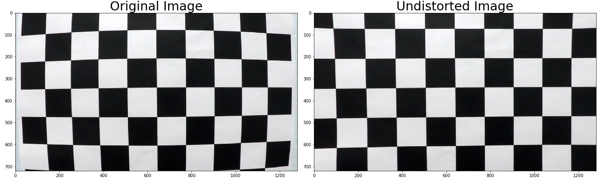
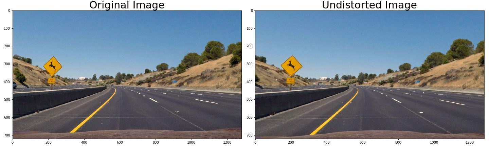
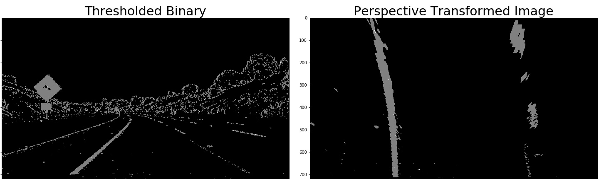
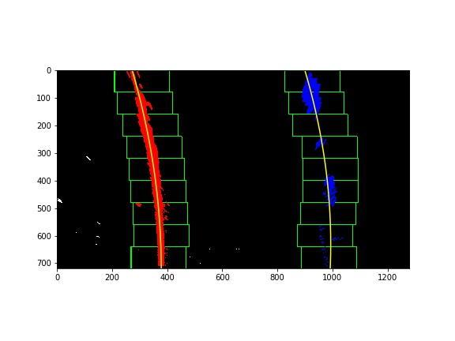
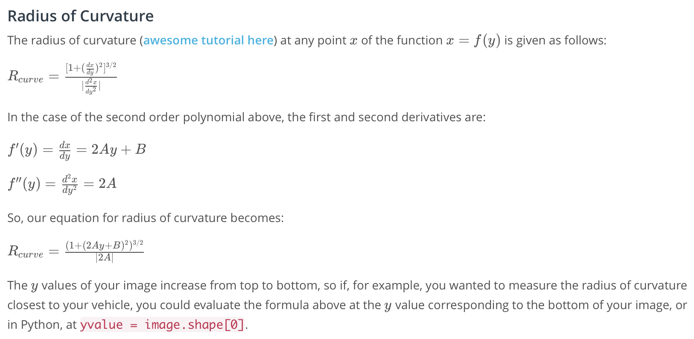
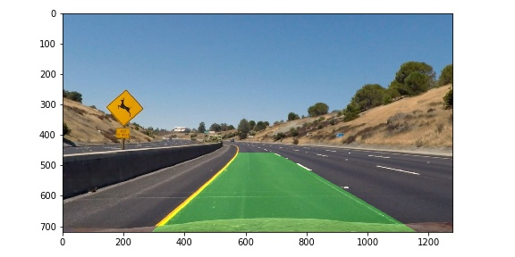

# Advanced Lane Finding Project

The goals / steps of this project are the following:

* Compute the camera calibration matrix and distortion coefficients given a set of chessboard images.
* Apply a distortion correction to raw images.
* Use color transforms, gradients, etc., to create a thresholded binary image.
* Apply a perspective transform to rectify binary image ("birds-eye view").
* Detect lane pixels and fit to find the lane boundary.
* Determine the curvature of the lane and vehicle position with respect to center.
* Warp the detected lane boundaries back onto the original image.
* Output visual display of the lane boundaries and numerical estimation of lane curvature and vehicle position.

### Camera Calibration

#### 1. How I computed the camera matrix and distortion coefficients.

The code for this step is contained in `1_CameraCalib.ipynb` .  

I used [chessboard pattern](http://docs.opencv.org/2.4/_downloads/pattern.png). The process is ..

1. get `objpoints` (3d points in real world space)

```
objp = np.zeros((nx*ny,3),np.float32)
objp[:,:2] = np.mgrid[0:nx, 0:ny].T.reshape(-1,2)
objpoints.append(objp)
```

2. get `imgpoints` (2d points in image plane)

```
img = cv2.imread(fname)
gray = cv2.cvtColor(img, cv2.COLOR_BGR2GRAY)
ret, corners = cv2.findChessboardCorners(gray, (nx,ny), None)
imgpoints.append(corners)
```

3. compute camera calibration matrix `mtx` & distortion coefficient `dist`

```
ret, mtx, dist, rvecs, tvecs = cv2.calibrateCamera(objpoints, imgpoints, img_size,None,None)
```

4. undistort image

```
dst = cv2.undistort(img, mtx, dist, None, mtx)
```



### Pipeline (single images)

#### 1. distortion-corrected image

The code for this step is contained in `1_CameraCalib.ipynb` .



#### 2. how to create a thresholded binary image.

The code for this step is contained in `2_Thresholding.ipynb` . I used a combination of color and gradient thresholds to generate a binary image (thresholding steps at cell # 5).


#### 3. how I performed a perspective transform

The code for this step is contained in `3_PerspectiveTransform.ipynb` .

I have adjusted the coordinates (`src`, `dst`) so that the dst lane line in `output_images/straight_lines1_undist.jpg` and `output_images/straight_lines2_undist.jpg` looks straight.

```
M = cv2.getPerspectiveTransform(src, dst)
warped = cv2.warpPerspective(img, M, img_size, flags=cv2.INTER_LINEAR)
```

the final parameter is the following ... :

```
img_size=(img.shape[1], img.shape[0])    
src = np.float32(
    [[(img_size[0] / 2) - 59, img_size[1] / 2 + 100],
    [((img_size[0] / 6) - 6), img_size[1]],
    [(img_size[0] * 5 / 6) + 50, img_size[1]],
    [(img_size[0] / 2 + 64), img_size[1] / 2 + 100]])
dst = np.float32(
    [[(img_size[0] / 4), 0],
    [(img_size[0] / 4), img_size[1]],
    [(img_size[0] * 3 / 4), img_size[1]],
    [(img_size[0] * 3 / 4), 0]])
```

| Source        | Destination   |
|:-------------:|:-------------:|
| 581, 460      | 320, 0        |
| 207.3, 720    | 320, 720      |
| 1116.7, 720   | 960, 720      |
| 704, 460      | 960, 0        |



#### 4. how I identified lane-line pixels and fit their positions with a polynomial

The code for this step is contained in `4_LaneFinding.ipynb` .

1. read the thresholded binary image (cell # 1)
2. sum up pixel values through y-axis within window (cell # 2)
3. treat argmax_x(sumed up pixel values) as lane center (cell # 3)
4. apply sliding window along y-axis (cell # 3)
5. fit polynomial (cell # 3)
6. visualize result (cell # 4)



#### 5. how I calculated the radius of curvature of the lane and the position of the vehicle with respect to center.

The code for this step is contained in `4_LaneFinding.ipynb` .

**calculate the radius of curvature of the lane (cell # 5)**

I used the following formula



**calculate the position of the vehicle with respect to center (cell # 6)**

I calculated the position of the vehicle using the distance from lane center to image center

#### 6. my result plotted back down onto the road such that the lane area is identified clearly.

The code for this step is contained in `4_LaneFinding.ipynb` (cell # 7 - # 9).



---

### Pipeline (video)

#### 1. Provide a link to your final video output.  Your pipeline should perform reasonably well on the entire project video (wobbly lines are ok but no catastrophic failures that would cause the car to drive off the road!).

Here's a [link to my video result](./project_video.mp4)

---

### Discussion

#### 1. Briefly discuss any problems / issues you faced in your implementation of this project.  Where will your pipeline likely fail?  What could you do to make it more robust?

Here I'll talk about the approach I took, what techniques I used, what worked and why, where the pipeline might fail and how I might improve it if I were going to pursue this project further.  
